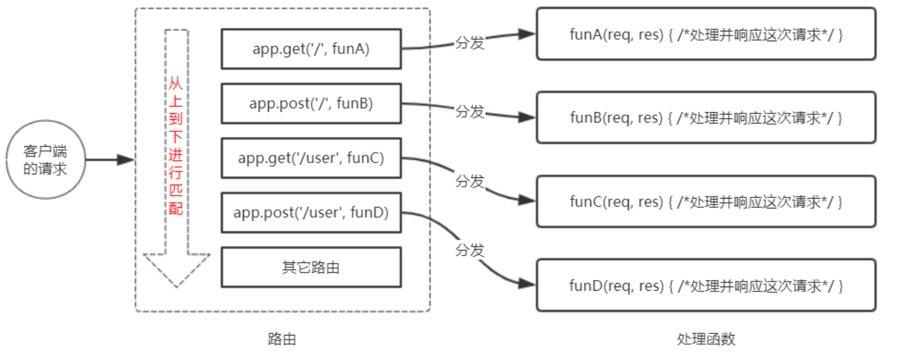

[toc]

## 01-Express 简介
### 1.1 什么是 `Express`

-   `Express` 是基于<font color="red">**Node.js 平台** </font>，快速、开放、极简的 <font color="red">**Web 开发框架** </font>。 
-   通俗的理解：`Express` 的作用和 `Node.js` 内置的 `http` 模块类似，是专门<font color="red">**用来创建 Web 服务器的** </font>。
-     <font color="red"> **Express 的本质**</font>:    就是一个 `npm` 上的第三方包，提供了快速创建 `Web` 服务器的便捷方法。
-   `Express` 的中文官网:      http://www.expressjs.com.cn/

### 1.2 `Express` 能做什么

对于前端程序员来说，最常见的**两种**服务器，分别是:
- <font color="red">`Web` 网站服务器</font>:    专门对外提供 `Web` 网页资源的服务器。
- <font color="red">`API` 接口服务器</font>:    专门对外提供 `API` 接口的服务器。

使用 `Express`，我们可以方便、快速的创建 `Web` 网站的服务器或 `API` 接口的服务器。

## 02- `Express` 的基本使用
### 2.1 安装
在项目所处的目录中，终端命令:  

<font color="red"> `npm i express`</font>

### 2.2 创建基本的 `Web` 服务器
```js
//1 载入 express
const  express = require("express");

//2 创建服务器 起名为 app
 const  app = express();

//3 调用 app.listen(端口号,启动成功后的回调函数)
 app.listen(3000,function(){

     console.log("http:127.0.0.1:3000");
 });
```
### 2.3 监听 `GET` 请求
通过 `app.get()` 方法，可以监听客户端的 `GET` 请求，具体的语法格式如下:
```js
//参数1:  客户端请求的 url 地址
//参数2:  请求对应的处理函数
// req 为请求对象(包含了请求相关的数据和方法),
// res 为响应对象(包含了响应相关的数据和方法)

 app.get("/getList",function(req,res){
     res.send({     })
 })
```
### 2.4 监听 `POST` 请求

通过 `app.post()` 方法，可以监听客户端的 `POST` 请求，具体的语法格式如下:
```js
//参数1:  客户端请求的  url  地址
//参数2:  请求对应的处理函数
//  req  为请求对象(包含了请求相关的数据和方法),
//  res  为响应对象(包含了响应相关的数据和方法)

 app.post("/getList",function(req,res){
     res.send({     })
 })
```
###  2.5 把内容响应给客户端
通过 `res.send()` 方法，可以把处理好的内容，发送给客户端:
```js
 app.get("/user",function(req,res){
//向客户端发送JSON对象
     res.send({name:"wang,age:18 })
 })

 app.post("/user",function(req,res){
//向客户端发送文本对象
     res.send("请求成功")
 })
```
### 2.6 获取 `URL` 中携带的查询参数
通过 `req.query` 对象，可以访问到客户端通过查询字符串的形式，发送到服务器的参数:
```js
 app.get("/",(req,res)=>{

//req.query 默认是一个空对象
//客户端使用?name=wang&age=20  这种查询字符串形式,发送至服务器的参数,
//可以通过req.query  对象访问到,例如:req.query.name或者req.query.age

    console.log( req.query )
 })
```
### 2.7 获取 `URL` 中的动态参数
通过 `req.params` 对象，可以访问到 `URL` 中，通过 : 匹配到的动态参数:
```js
//URL  地址中,可以通过:参数名的形式,匹配动态参数值

app.get('/user/:id', (req,res)=>{

//req.params  默认是一个空对象
//里面存放着通过:动态匹配到的参数值

console.log(  req.params )
})
```
## 03-托管静态资源
### 3.1 `express.static()`
`express` 提供了函数`express.static()`，通过它，可以创建一个静态资源服务器，通过如下代码就可以访问 `public` 目录下的图片、`CSS` 文件、`JavaScript` 文件:`app.use(express.static('public'))`

现在，你就可以访问 `public` 目录中的所有文件了: 
http://localhost:3000/images/bg.jpg
http://localhost:3000/css/style.css
http://localhost:3000/js/login.js 
因此，存放静态文件的目录名不会出现在 `URL` 中。
 <font color="red"> **注意**</font>: `Express` 在指定的静态目录中查找文件，并对外提供资源的访问路径。

### 3.2 托管多个静态资源目录
如果要托管多个静态资源目录，请多次调用 `express.static()` 函数:
`app.use(express.static('public') );`
`app.use(express.static('files') );`
访问静态资源文件时，`express.static()` 函数会根据目录的添加顺序查找所需的文件。
### 3.3 挂载路径前缀
如果希望在托管的静态资源访问路径之前，挂载路径前缀，则可以使用如下的方式:
`app.use('/public', express.static('public'));`

现在，你就可以通过带有 `/public` 前缀地址来访问 `public` 目录中的文件了: 
http://localhost:3000/public/images/kitten.jpg 
http://localhost:3000/public/css/style.css 
http://localhost:3000/public/js/app.js

## 04-nodemon

### 4.1 为什么要使用 nodemon
在编写调试 Node.js 项目的时候，如果修改了项目的代码，则需要频繁的手动 close 掉，然后再重新启动，非常繁琐。

现在，我们可以使用 nodemon(https://www.npmjs.com/package/nodemon) 这个工具，它能够监听项目文件 的变动，当代码被修改后，nodemon 会自动帮我们重启项目，极大方便了开发和调试。
### 4.2 安装 nodemon
在终端中，运行如下命令:`npm install -g nodemon`，即可将 `nodemon` 安装为全局可用的工具:

### 4.3 使用 nodemon
传统的方式-->是运行命令: `node app.js` ，来启动项目。
==>这样做的坏处是:代码被修改之后，需要手动重启项目。

现在-->运行 nodemon 命令: `nodemon app.js` 来启动项目。==>这样做的好处是:代码 被修改之后，会被 nodemon 监听到，从而实现自动重启项目的效果。
## 05-Express路由
### 5.1 什么是路由
广义上来讲，路由就是映射关系。
###  5.2 Express 中的路由
- 在 Express 中，路由指的是客户端的请求与服务器处理函数之间的映射关系。
Express 中的路由分 3 部分组成，分别是**请求的类型**、**请求的 URL 地址**、**处理函数**，格式如下:
`app.METHOD(PATH,HANDLER)`

- Express 中的路由的例子
```js
//匹配GET请求,且请求uRL为/
app.get('/', function(req,res){
res.send('hello World')
})

//匹配post请求,且请求URL为/
app.post('/', function(req,res){
res.send('Got a POST request')
})
```
### 5.3 路由的概念
- 路由的匹配过程
每当一个请求到达服务器之后，需要先经过路由的匹配，只有匹配成功之后，才会调用对应的处理函数。

在匹配时，会按照路由的顺序进行匹配，如果请求类型和请求的 URL 同时匹配成功，则 Express 会将这次请求，转 交给对应的 function 函数进行处理。

- 路由匹配的注意点:
    - 1 按照定义的先后顺序进行匹配
    - 2 请求类型和请求的URL同时匹配成功，才会调用对应的处理函数


### 5.4 路由的使用
#### 5.4.1 最简单的用法
在 Express 中使用路由最简单的方式，就是把路由挂载到 app 上，示例代码如下:
```js
const express =require('express');
//创建文本服务器,命名为app
const app=express();
//挂载路由
app.get('/',(req,res)=>{res.send('hello world')  } );
app.post('/',(req,res)=>{res.send('Post Request')  } );

//启动web服务器
app.listen(3000,()=>{console.log("server running at http:127.0.0.1:3000")  })
```

#### 5.4.2 模块化路由

为了方便对路由进行模块化的管理，Express 不建议将路由直接挂载到 app 上，而是推荐将路由抽离为单独的模块。

将路由抽离为单独模块的步骤如下:
- 1 创建路由模块对应的 .js 文件
- 2 调用 express.Router() 函数创建路由对象
- 3 向路由对象上挂载具体的路由
- 4 使用 module.exports 向外共享路由对象
- 5 使用 app.use() 函数注册路由模块

#### 5.4.3 创建路由模块
```js
//导入express
var  express =require('express');  
//创作路由对象 
var router=express.Router();          
//挂载获取用户列表的路由
router.get('./user/list',function(req.res)=>{   
res.send("Get user List.");
})
//挂载添加用户列表的路由
router.post('./user/add',function(req.res)=>{   
res.send("Add user List.");
})
//向外导出路由对象
module.exports=router;   
```
####  5.4.4 注册路由模块
```js
//1导入路由模块
const userRouter=require('./router/user.js');

//2  使用app.use()注册路由模块
app.use(userRouter)   
```
#### 5.4.5 为路由模块添加前缀
类似于托管静态资源时，为静态资源统一挂载访问前缀一样，路由模块添加前缀的方式也非常简单:
```js
//1导入路由模块
const userRouter=require('./router/user.js')

//2.使用app.use()  注册路由模块,并添加统一的访问前缀/api
app.use('/api',userRouter)
```
## 06-`Express` 中间件
### 6.1 中间件的概念
#### 6.1.1 什么是中间件
中间件(Middleware )，特指业务流程的中间处理环节。
#### 6.1.2 Express 中间件的调用流程
当一个请求到达 `Express` 的服务器之后，可以连续调用多个中间件，从而对这次请求进行预处理。


#### `Express` 中间件的格式
`Express` 的中间件，本质上就是一个 `function` 处理函数，`Express` 中间件的格式如下:


**注意**:
- 中间件函数的形参列表中，必须包含 `next` 参数。
- 而路由处理函数中只包含 `req` 和 `res`。

#### `next` 函数的作用
`next` 函数是实现多个中间件连续调用的关键，
它表示把流转关系转交给下一个中间件或路由。


### `Express` 中间件的初体验
#### 定义中间件函数
可以通过如下的方式，定义一个最简单的中间件函数:
```js
//常量mw所指向的,就是一个中间函数

const mw=function (req,res,next){
console.log('这是一个最简单的中间件函数')

//注意:当前中间件的业务处理完毕后,必须调用next()函数
//表示把流转关系交给了下一个中间件函数或路由

next()
}
```
####  全局生效的中间件
客户端发起的任何请求，到达服务器之后，都会触发的中间件，叫做全局生效的中间件。 通过调用 app.use(中间件函数)，即可定义一个全局生效的中间件，示例代码如下:
```js
//常量mw所指向的,就是一个中间函数
const mw=function (req,res,next){
console.log('这是一个最简单的中间件函数')
//注意:当前中间件的业务处理完毕后,必须调用next()函数
//表示把流转关系交给了下一个中间件函数或路由
next()
}

//全局生效的中间件
app.use(mw)
```
#### 定义全局中间件的简化形式
```js
//全局生效的中间件
app.use(  function(req,res,next){
console.log('这是一个简单的中间件函数')

next()
})
```
#### 中间件的作用
多个中间件之间，共享同一份 req 和 res。基于这样的特性，我们可以在上游的中间件中，统一为 req 或 res 对象添加自定义的属性或方法，供下游的中间件或路由进行使用。


#### 定义多个全局中间件
可以使用 app.use() 连续定义多个全局中间件。客户端请求到达服务器之后，会按照中间件定义的先后顺序依次进行 调用，示例代码如下:
```js
//第一个全局中间件
app.use(function(req,res,next){  
console.log('调用了第一个全局中间件')
next()
})
 //第二个全局中间件
app.use(function(req,res,next){ 
console.log('调用了第二个全局中间件')
next()
})
//q请求这个路由,会依次触发上述两个全局中间件
app.get('./user',(req,res)=>{  
res.send('Home page')
})
```

#### 局部生效的中间件
不使用 app.use() 定义的中间件，叫做局部生效的中间件，示例代码如下:
```js
//定义中间件函数  mw1
const mw1=function(req,res,next){
console.log('这是中间件函数');
next()
}
//mw1 这个中间件只在'当前路由中生效',这种用法属于"局部生效的中间件"
app.get('/',mw1,function(req,res){
res.send('Home page')
})
//mw1这个中间件不会影响下面这个路由
app.get("/user",function(req,res){res.send("User page")  })

```
#### 定义多个局部中间件
可以在路由中，通过如下两种等价的方式，使用多个局部中间件:
```js
//以下两种写法是"完全等价"的,可根据自己的喜好,任意选择一种方式进行使用
app.get('/',  mw1, mw2, (req,res)=>{res.send("Home page")  })
app.get('/', [mw1, mw2], (req,res)=>{res.send("Home page")  })
```
#### 了解中间件的5个使用注意事项
- 1 一定要在路由之前注册中间件
- 2 客户端发送过来的请求，可以连续调用多个中间件进行处理
- 3 执行完中间件的业务代码之后，不要忘记调用 next() 函数
- 4 为了防止代码逻辑混乱，调用 next() 函数后不要再写额外的代码 5 连续调用多个中间件时，多个中间件之间，共享 req 和 res 对象

### 中间件的分类

####  应用级别的中间件
通过 app.use() 或 app.get() 或 app.post() ，绑定到 app 实例上的中间件，叫做应用级别的中间件，代码示例如下:
```js
//应用级别的中间件(全局中间件)
app.use((req,res,next)=>{
next()
})
//应用级别的中间件(局部中间件)
app.get('/',mw1,(req,res)=>{
res.send("Home page")
})
```
#### 路由级别的中间件
绑定到 express.Router() 实例上的中间件，叫做路由级别的中间件。它的用法和应用级别中间件没有任何区别。只不 过，应用级别中间件是绑定到 app 实例上，路由级别中间件绑定到 router 实例上，代码示例如下:
```js
var app = express()
var router = express.Router()

//路由级别的中间件
router.use(function(req,res,next){
    console.log("Time:",Date.now() )
    next()
})
app.use('/',router)
```
#### 3 错误级别的中间件

**错误级别中间件的作用**:专门用来捕获整个项目中发生的异常错误，从而防止项目异常崩溃的问题。
**格式**:错误级别中间件的 `function` 处理函数中，必须有 4 个形参，形参顺序从前到后，分别是 (err, req, res, next)。

**注意**:错误级别的中间件， 必须注册在所有路由之后!
```js
app.get('/',(req,res)=>{       // 1.路由
    throw new Error("服务器内部发生了错误！")    //1.1 抛出一个自定义的错误！
    res.send("Home Page!")   
})
app.use((err,req,res,next)=>{           //2. 错误级别的中间件
    console.log("发生了错误："+ err.message )   //  2.1  在服务器打印错误消息
    res.send("Error!"+ err.message)    //2.2  向客户单相应错误相关的内容
})
```
#### 4 `Express` 内置的中间件 

错误级别中间件的 `function` 处理函数中，必须有 4 个形参，形参顺序从前到后，分别是 (err, req, res, next)。
**注意**:错误级别的中间件， 必须注册在所有路由之后!
```js
app.get('/',(req,res)=>{       // 1.路由
    throw new Error("服务器内部发生了错误！")    //1.1 抛出一个自定义的错误！
    res.send("Home Page!")   
})
app.use((err,req,res,next)=>{           //2. 错误级别的中间件
    console.log("发生了错误："+ err.message )   //  2.1  在服务器打印错误消息
    res.send("Error!"+ err.message)    //2.2  向客户单相应错误相关的内容
})
```
#### 5 第三方的中间件
- 非 `Express` 官方内置的，而是由第三方开发出来的中间件，叫做第三方中间件。在项目中，大家可以按需下载并配置第三方中间件，从而提高项目的开发效率。
- 例如:在 express@4.16.0 之前的版本中，经常使用 body-parser 这个第三方中间件，来解析请求体数据。使用步 骤如下:
    - 1 运行 `npm install body-parser` 安装中间件 
    - 2 使用 `require` 导入中间件
    - 3 调用 `app.use()` 注册并使用中间件

- **注意**: Express 内置的 express.urlencoded 中间件，就是基于 body-parser 这个第三方中间件进一步封装出来的。

### 自定义中间件

#### 使用 `app.use()` 来定义全局生效的中间件
代码如下:
```js
app.use((req,res,next)=>{
//中间件的业务逻辑
})
```
#### 监听 `req` 的 `data` 事件
在中间件中，需要监听 `req` 对象的 `data` 事件，来获取客户端发送到服务器的数据。
如果数据量比较大，无法一次性发送完毕，则客户端会把数据切割后，分批发送到服务器。所以 `data` 事件可能会触 发多次，每一次触发 `data` 事件时，获取到数据只是完整数据的一部分，需要手动对接收到的数据进行拼接。

```js
//定义变量， 用来存储客户端发送过来的请求体数据
let  str = ''

//监听 req 对象的 data 事件（客户端发送过来的新的请求体数据）
req.on('data',(chunk) =>{

    //拼接请求体数据，隐式转换为字符串
    str += chunk
})
```
#### 监听 `req` 的 `end` 事件
当请求体数据接收完毕之后，会自动触发 `req` 的 `end` 事件。
因此，我们可以在 `req` 的 `end` 事件中，拿到并处理完整的请求体数据。示例代码如下:
```js

//监听 req 对象的 end 事件（请求体发送完毕后自动触发 ）
req.on('end',() =>{

    //打印完整的请求体数据
    console.log(str)

    // ToDo： 把字符串格式的请求体数据，解析为对象格式
})
```
#### 使用 `querystring` 模块解析请求体数据
`Node.js` 内置了一个 `querystring` 模块，专门用来处理查询字符串。通过这个模块提供的 `parse()` 函数，可以轻松把 查询字符串，解析成对象的格式。示例代码如下:
```js
// 导入处理  queryString 的 node.js 内置模块

const qs = require('querystring')

//调用 qs.parse()  方法 把查询字符串解析为对象
const body = qs.parse(str)

```
#### 将解析出来的数据对象挂载为 `req.body`
上游的中间件和下游的中间件及路由之间，共享同一份 `req` 和 `res` 。因此，我们可以将解析出来的数据，挂载为 `req` 的自定义属性，命名为 `req.body`，供下游使用。示例代码如下:
```js
req.on('end',()=>{
    const body = qs.parse(str)//调用 qs.parse() 方法，把查询字符串解析为对象
    req.body = body    //将解析出来的请求体对象，挂载为req.body 属性
    next()      //  最后，一定要调用 next() 函数  执行后续的业务逻辑
})
```
#### 将自定义中间件封装为模块
为了优化代码的结构，我们可以把自定义的中间件函数，封装为独立的模块，示例代码如下:

```js
//custom-body-parser.js模块中的代码
const qs = require('querystring')

function bodyParser(req,res,next){ /*省略其他代码*/  }
module.exports = bodyParse    //向外导出解析请求体数据的中间件函数


// ------------分割线 --------------------------
const mybodyParse = require('custom-body-parser')

//2.  注册自定义的中间件模块
app.use(mybodyParse)

```

## 07-使用 Express 写接口

### 创建基本的服务器
```js
//载入express
var express = require('express')
//创建服务器
var app = express();

// 内置的express 解析表单的中间件
app.use(express.urlencoded({extended: false}))

//解决跨域方法1:
// app.use("*", function(req, res, next) {
// 	res.setHeader('Access-Control-Allow-Origin', '*');
// 	res.setHeader("Access-Control-Allow-Methods", "*");
// 	res.setHeader("Access-Control-Allow-Headers", "content-type");
// 	next();
// });

//解决跨域方法2:
var cors = require('cors');
app.use(cors())

//载入路由
var router = require('./09.user')
//使用路由
app.use('/api',router)

//调用app.listen方法,指定端口号并启动文本服务器
app.listen(8081,function(){
    console.log(" it is running")
})
```
### 创建 API 路由模块
```js
//apiRouter.js[路由模块]
const express =require("express);
const apiRouter=express.Router();


module.exports=api.Router

//api.js[导入并注册路由模块]
const apiRouter=require('./apiRouter.js')
app.use('./api',apiRouter)
```
### 编写 GET 接口
```js
apiRouter.get('./get',(req,res)=>{
//1获取到客户端通过查询字符串,发送到服务器的数据
const query=req.query;

//2 调用res.send() 方法,把数据响应给客户端
res.send({
    status:0,            //状态  0表示成功,1表示失败
    msg:"GET请求成功",    //状态描述
    data:query            //需要响应给客户端的具体数据
    })
})
```
### 编写 POST 接口
```js
 apiRouter.post('./post',(req,res)=>{
//1获取到客户端通过请求体, 发送到服务器的URL-encoded数据
const  body=req.body;

//2 调用res.send() 方法,把数据响应给客户端
res.send({
    status:0,              //状态  0表示成功,1表示失败
    msg:"post请求成功",    //状态描述消息
    data:body              //需要响应给客户端的具体数据
    })
})
```
### `CORS` 跨域资源共享
#### 接口的跨域问题
- 刚才编写的 `GET` 和 `POST` 接口，存在一个很严重的问题:不支持跨域请求。 解决接口跨域问题的方案主要有两种:
    - 1 `CORS` (主流的解决方案，推荐使用)
    - 2 `JSONP` (有缺陷的解决方案:只支持 `GET` 请求)

`cors` 是 `Express` 的一个第三方中间件。通过安装和配置 `cors` 中间件，可以很方便地解决跨域问题。 

使用步骤分为如下 3 步:

- 1 运行 `npm install cors` 安装中间件
- 2 使用 `const cors = require('cors')` 导入中间件
- 3 在路由之前调用 `app.use(cors())` 配置中间件

#### 什么是 `CORS`
`CORS` (`Cross-Origin Resource Sharing`，跨域资源共享)由一系列 `HTTP` 响应头组成，这些 `HTTP` 响应头决定浏览器是否阻止前端 `JS` 代码跨域获取资源。

浏览器的同源安全策略默认会阻止网页“跨域”获取资源。但如果接口服务器配置了 `CORS` 相关的 `HTTP` 响应头， 就可以解除浏览器端的跨域访问限制。


#### `CORS` 的注意事项
1 `CORS` 主要在服务器端进行配置。客户端浏览器无须做任何额外的配置，即可请求开启了 `CORS` 的接口。

2 `CORS` 在浏览器中有兼容性。只有支持 `XMLHttpRequest Level2` 的浏览器，才能正常访问开启了 `CORS` 的服 务端接口(例如:`IE10+`、`Chrome4+`、`FireFox3.5+`)。

#### `CORS` 响应头部 - `Access-Control-Allow-Origin`
- 响应头部中可以携带一个 `Access-Control-Allow-Origin` 字段，其语法如下:

`Access-Control-Allow-Origin: <origin> | *`

- `origin` 参数的值指定了允许访问该资源的外域 `URL`。 

例如，下面的字段值将只允许来自 http://itcast.cn 的请求:

`res.setHeader(' Access-Control-Allow-Origin',  'http://itcast.cn'  )`

- 如果指定了 `Access-Control-Allow-Origin` 字段的值为通配符 `*`，表示允许来自任何域的请求，示例代码如下:

`res.setHeader(' Access-Control-Allow-Origin',  '*'  )`
####  `CORS` 响应头部 -`Access-Control-Allow-Methods`
默认情况下， `CORS` 仅支持客户端发起 `GET`、`POST`、`HEAD` 请求。
如果客户端希望通过 `PUT`、`DELETE` 等方式请求服务器的资源，则需要在服务器端，通过 `Access-Control-Alow-Methods` 来指明实际请求所允许使用的 `HTTP` 方法。
示例代码如下:
```js
//只允许 post get delete head 请求方法
res.setHeader('Access-Control-Alow-Methods','POST,GET,DELETE,HEAD')

//允许所有的  http  请求方法
res.setHeader('Access-Control-Alow-Methods','*')
```

#### `CORS` 请求的分类
客户端在请求 `CORS` 接口时，根据请求方式和请求头的不同，可以将 `CORS` 的请求分为两大类，分别是:**简单请求**和**预检请求**
##### 简单请求：
同时满足以下两大条件的请求，就属于简单请求:
- 1 请求方式:`GET`、`POST`、`HEAD` 三者之一
- 2 `HTTP` 头部信息不超过以下几种字段:无自定义头部字段、`Accept`、`Accept-Language`、`Content-Language`、`DPR`、 `Downlink`、`Save-Data`、`Viewport-Width`、`Width` 、`Content-Type`(只有三个值`application/x-www-form-urlencoded`、`multipart/form-data`、`text/plain`)

##### 预检请求
只要符合以下任何一个条件的请求，都需要进行预检请求:
- 1 请求方式为 `GET`、 `POST` 、 `HEAD` 之外的请求 `Method` 类型 
- 2 请求头中包含自定义头部字段
- 3 向服务器发送了 `application/json` 格式的数据

在浏览器与服务器正式通信之前，浏览器会先发送 `OPTION` 请求进行预检，以获知服务器是否允许该实际请求，所以这一 次的 `OPTION` 请求称为“预检请求”。服务器成功响应预检请求后，才会发送真正的请求，并且携带真实数据。
##### 简单请求和预检请求的区别
简单请求的特点:客户端与服务器之间只会发生一次请求。 预检请求的特点:客户端与服务器之间会发生两次请求， `OPTION` 预检请求成功之后，才会发起真正的请求。

### JSONP 接口
**概念**:浏览器端通过 `<script>` 标签的 `src` 属性，请求服务器上的数据，同时，服务器返回一个函数的调用。这种请求数据的方式叫做 `JSONP`。
**特点**:
- 1 `JSONP` 不属于真正的 `Ajax` 请求，因为它没有使用 `XMLHttpRequest` 这个对象。 
- 2 `JSONP` 仅支持 `GET` 请求，不支持 `POST` 、 `PUT` 、 `DELETE` 等请求。
