[toc]

## 模块化的基本概念

### 1.1 什么是模块化

> 模块化是指解决一个复杂问题时，自顶向下逐层把系统划分成若干模块的过程。对于整个系统来说，模块是可组合、分解和更换的单元。

#### 1. 现实生活中的模块化

####  2. 编程领域中的模块化

- 编程领域中的模块化，就是遵守<font color="red">固定的规则</font>，把一个<font color="red">大文件</font>拆成独立并互相依赖的<font color="red">多个小模块</font>。
        - 把代码进行模块化拆分的好处：
            - 提高了代码的<font color="red">复用性</font>
            - 提高了代码的<font color="red">可维护性</font>
            - 可以实现 <font color="red"> 按需加载 </font>

### 1.2 模块化规范

- <font color="red">模块化规范</font>就是对代码进行模块化的拆分与组合时，需要遵守的那些规则。
- 例如：
    - 使用什么样的语法格式来<font color="red">引用模块</font>
    - 在模块中使用什么样的语法格式<font color="red">向外暴露成员</font>

- <font color="red">模块化规范的好处</font>：大家都遵守同样的模块化规范写代码，降低了沟通的成本，极大方便了各个模块之间的相互调用，利人利己。


## `Node.js` 中模块化

### 2.1 `Node.js` 中模块的分类

- `Node.js` 中根据模块来源的不同，将模块分为了 3 大类，分别是：
    - <font color="red">内置模块</font>（内置模块是由 `Node.js` 官方提供的，例如 `fs` 、 `path` 、 `http` 等）
    - <font color="red">自定义模块</font>（用户创建的每个 `.js` 文件，都是自定义模块）
    - <font color="red">第三方模块</font>（由第三方开发出来的模块，并非官方提供的内置模块，也不是用户创建的自定义模块，使用前需要先下载）

### 2.2 <font color="red">加载</font>模块

- 使用强大的<font color="red"> `require()` </font>方法，可以加载需要的内置模块、用户自定义模块、第三方模块进行使用。例如：
```js
//加载内置 fs 模块
const fs = require('fs')

//加载用户的自定义模块
const custom = require('./custom.js')

//加载第三方模块 （关于第三方模块的下载和使用，会在后面的课程中进行专门的讲解）
const moment = require('moment')
```

- <font color="red">注意</font>：使用 `require()` 方法加载其它模块时，会执行被加载模块中的代码。

### 2.3 Node.js 中的<font color="red">模块作用域</font>

#### 1. 什么是模块作用域

和<font color="red">函数作用域</font>类似，在自定义模块中定义的变量、方法等成员，<font color="red">只能在当前模块内被访问</font>，<font color="red">这种模块级别的访问限制</font>，叫做<font color="red">模块作用域</font>。

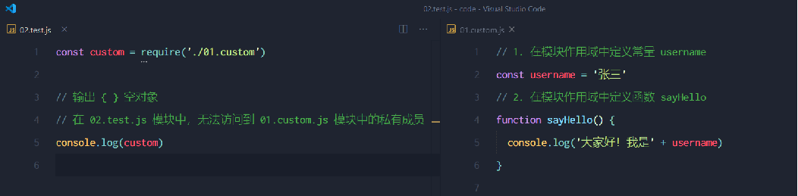

#### 2. 模块作用域的<font color="red">好处</font>
防止了全局变量污染的问题
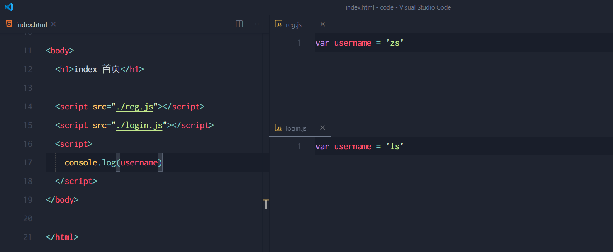

### 2.4 向外共享模块作用域中的成员

#### 1. <font color="red">`module`</font> 对象
在每个 `.js` 自定义模块中都有一个 `module` 对象，<font color="red">它里面存储了和当前模块有关的信息</font>，打印如下：
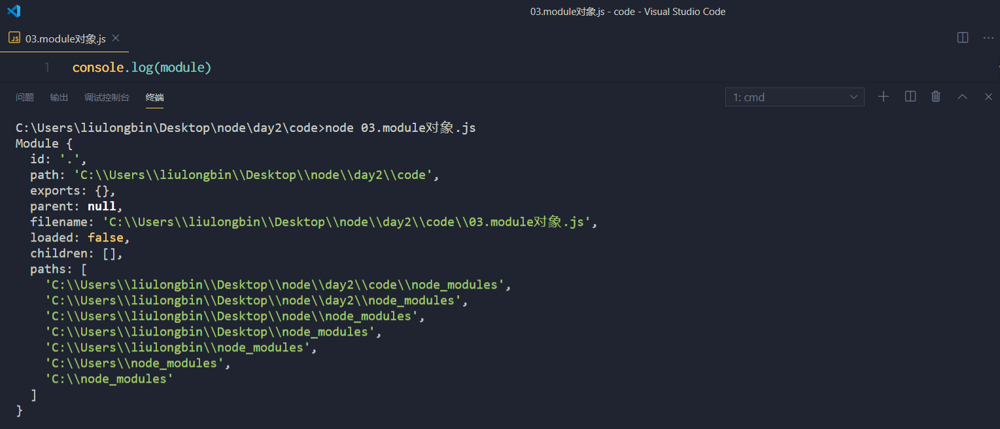

#### 2. <font color="red">`module.exports`</font> 对象
在自定义模块中，可以使用 `module.exports` 对象，将模块内的成员共享出去，供外界使用。
外界用<font color="red"> `require()` </font>方法导入自定义模块时，得到的就是 `module.exports` 所指向的对象。


#### 3. 共享成员时的<font color="red">注意点</font>
- 使用 `require()` 方法导入模块时，导入的结果，<font color="red">永远以 `module.exports` 指向的对象为准</font>。

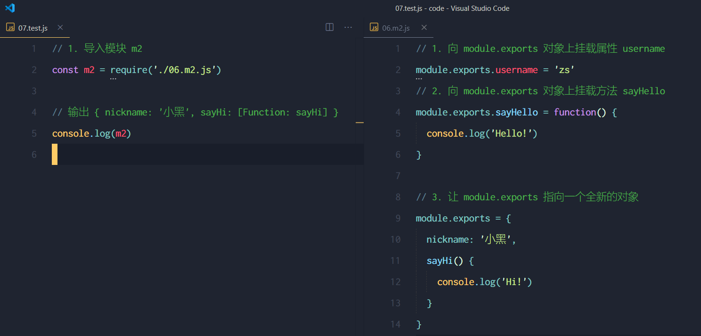

#### 4. <font color="red">`exports` 对象</font>
- 由于 `module.exports` 单词写起来比较复杂，为了简化向外共享成员的代码， `Node` 提供了 `exports` 对象。<font color="red">默认情况下，`exports` 和 `module.exports` 指向同一个对象。</font> 最终共享的结果，还是以 `module.exports` 指向的对象为准。

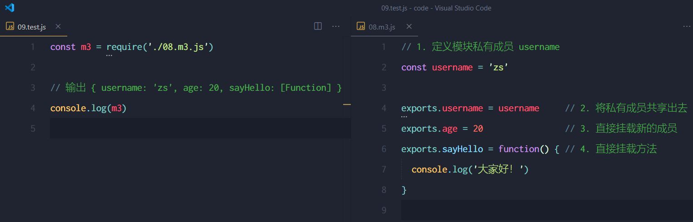

#### 5. `exports` 和 `module.exports` 的使用误区

- 时刻谨记，`require()` 模块时，得到的永远是<font color="red"> `module.exports`</font> 指向的对象：
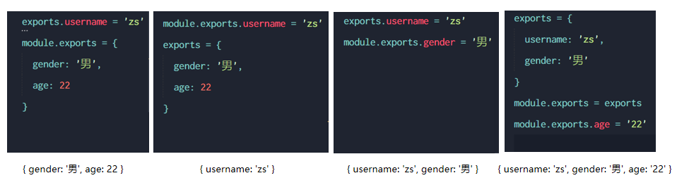

- <font color="red">注意</font>：为了防止混乱，建议大家不要在同一个模块中同时使用 `exports` 和 `module.exports`

### 2.5 `Node.js` 中的模块化规范
- `Node.js `遵循了 `CommonJS` 模块化规范， `CommonJS` 规定了<font color="red">模块的特性</font>和<font color="red">各模块之间如何相互依赖</font>。

- `CommonJS` 规定：
    - 每个模块内部， `module` 变量代表当前模块。
    - `module` 变量是一个对象，它的 `exports` 属性（即<font color="red">` module.exports`</font>）<font color="red">是对外的接口</font>。
    - 加载某个模块，其实是加载该模块的 `module.exports` 属性。<font color="red">`require()` 方法用于加载模块。</font>


## `npm` 与包

### 3.1 包

#### 1. 什么是包
`Node.js` 中的<font color="red">第三方模块</font>又叫做<font color="red">包</font>。
就像电脑和计算机指的是相同的东西，第三方模块和包指的是同一个概念，只不过叫法不同。

#### 2. 包的来源
不同于 `Node.js` 中的内置模块与自定义模块，<font color="red">包是由第三方个人或团队开发</font>出来的，免费供所有人使用。
<font color="red">注意</font>：`Node.js` 中的包都是免费且开源的，不需要付费即可免费下载使用。

#### 3. 为什么需要包
由于 `Node.j`s 的内置模块仅提供了一些底层的 API，导致在基于内置模块进行项目开发的时，效率很低。
<font color="red">包是基于内置模块封装出来的</font>，提供了更高级、更方便的 `API`，<font color="red">极大的提高了开发效率</font>。
<font color="red">包</font>和<font color="red">内置模块</font>之间的关系，类似于<font color="red"> jQuery</font> 和 <font color="red">浏览器内置 API </font>之间的关系。

#### 4. 从哪里下载包
国外有一家 IT 公司，叫做 <font color="red">npm, Inc</font>. 这家公司旗下有一个非常著名的网站： https://www.npmjs.com/ ，它是<font color="red">全球最大的包共享平台</font>，你可以从这个网站上搜索到任何你需要的包，只要你有足够的耐心！
到目前位置，全球约 1100 多万的开发人员，通过这个包共享平台，开发并共享了超过 120 多万个包 供我们使用。
<font color="red">npm, Inc.</font> 公司提供了一个地址为 https://registry.npmjs.org/ 的服务器，来对外共享所有的包，我们可以从这个服务器上下载自己所需要的包。

<font color="red">注意</font>：
 从 https://www.npmjs.com/ 网站上搜索自己所需要的包
 从 https://registry.npmjs.org/  服务器上下载自己需要的包

#### 5. 如何下载包
<font color="red">npm, Inc. </font>公司提供了一个包管理工具，我们可以使用这个包管理工具，从 https://registry.npmjs.org/ 服务器把需要的包下载到本地使用。
这个包管理工具的名字叫做 `Node Package Manager`（简称 `npm` 包管理工具），这个包管理工具随着 `Node.js` 的安装包一起被安装到了用户的电脑上。
大家可以在终端中执行<font color="red"> npm -v </font>命令，来查看自己电脑上所安装的 `npm` 包管理工具的版本号

### 3.2 `npm` 初体验

#### 1. 格式化时间的传统做法
- 创建格式化时间的自定义模块
- 定义格式化时间的方法
- 创建补零函数
- 从自定义模块中导出格式化时间的函数
- <font color="red">导入格式化时间的自定义模块</font>
- <font color="red">调用格式化时间的函数</font>
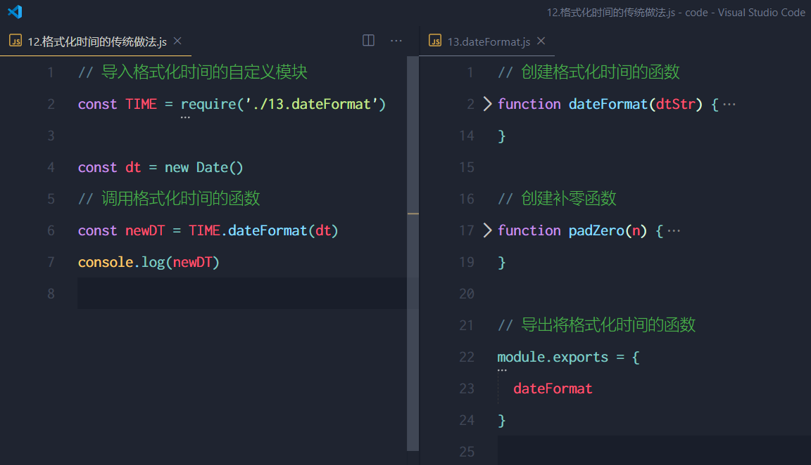

#### 2. 格式化时间的高级做法
<font color="red">使用 `npm` 包管理工具，在项目中安装格式化时间的包 moment</font>
使用 `require() `导入格式化时间的包
参考 `moment` 的官方` API` 文档对时间进行格式化
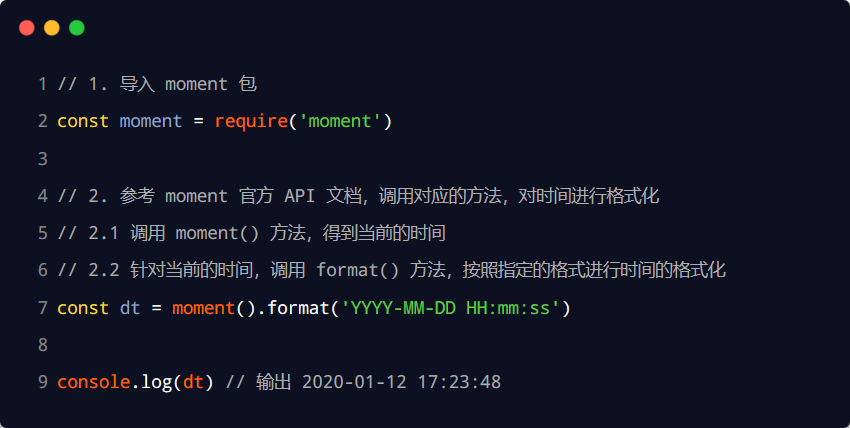

#### 3. 在项目中安装包的命令
- 如果想在项目中安装指定名称的包，需要运行如下的命令：`npm install 包的完整名称`
- 上述的装包命令，可以简写成如下格式：`npm i 包的完整名称`

#### 4. 初次装包后多了<font color="red">哪些文件</font>

初次装包完成后，在项目文件夹下多一个叫做<font color="red"> `node_modules`</font> 的文件夹和<font color="red"> `package-lock.json` </font>的配置文件。

其中：
<font color="red">`node_modules`</font> 文件夹用来<font color="red">存放所有已安装到项目中的包</font>。require() 导入第三方包时，就是从这个目录中查找并加载包。
<font color="red">`package-lock.json`</font> 配置文件用来<font color="red">记录 node_modules 目录下的每一个包的下载信息</font>，例如包的名字、版本号、下载地址等。

<font color="red">注意</font>：程序员不要手动修改 `node_modules` 或 `package-lock.json` 文件中的任何代码，`npm` 包管理工具会自动维护它们。

#### 5. 安装指定版本的包
默认情况下，使用 `npm install` 命令安装包的时候，会<font color="red">自动安装最新版本的包</font>。如果需要安装指定版本的包，可以在包名之后，通过 <font color="red">@ 符号</font>指定具体的版本，例如：`npm i moment@2.22.2`

#### 6. 包的<font color="red">语义化版本规范</font>
包的版本号是以“点分十进制”形式进行定义的，总共有三位数字，例如 2.24.0
其中每一位数字所代表的的含义如下：
第1位数字：<font color="red">大版本</font>
第2位数字：功能版本
第3位数字：Bug修复版本

<font color="red">版本号提升的规则</font>：只要前面的版本号增长了，则后面的版本号归零。

### 3.3 包管理配置文件

- `npm` 规定，在<font color="red">项目根目录</font>中，<font color="red">必须</font>提供一个叫做 <font color="red">package.json</font> 的包管理配置文件。用来记录与项目有关的一些配置信息。例如：
    - 项目的名称、版本号、描述等
    - 项目中都用到了哪些包
    - 哪些包只在<font color="red">开发期间</font>会用到
    - 那些包在<font color="red">开发</font>和<font color="red">部署</font>时都需要用到

#### 1. 多人协作的问题

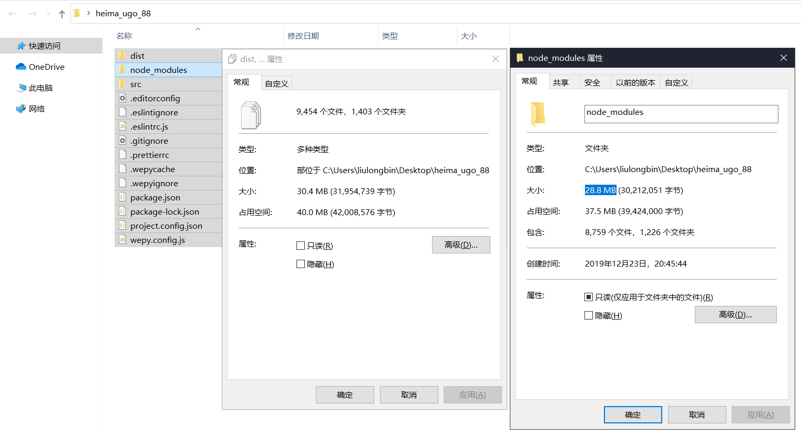
整个项目的体积是 30.4M
第三方包的体积是 28.8M
项目源代码的体积 1.6M

<font color="red">遇到的问题：第三方包的体积过大，不方便团队成员之间共享项目源代码。</font>

<font color="red">解决方案：共享时剔除`node_modules`</font>

#### 2. 如何记录项目中安装了哪些包

在项目根目录中，创建一个叫做 `package.json` 的配置文件，即可用来记录项目中安装了哪些包。从而方便剔除 `node_modules` 目录之后，在团队成员之间共享项目的源代码。

- <font color="red">注意</font>：
    - 今后在项目开发中，一定要把 `node_modules` 文件夹，添加到 `.gitignore` 忽略文件中。

#### 3. 快速创建 `package.json`

`npm` 包管理工具提供了一个<font color="red">快捷命令</font>，可以<font color="red">在执行命令时所处的目录</font>中，快速创建 `package.json` 这个包管理配置文件：

```sh
# 作用：在执行命令所处的目录中，快速新建 package.json 文件
npm init -y
```
- <font color="red">注意</font>：
    - 上述命令<font color="red">只能在英文的目录</font>下成功运行！所以，项目文件夹的名称<font color="red">一定要使用英文命名，不要使用中文，不能出现空格</font>。
    - 运行` npm install` 命令安装包的时候，`npm` 包管理工具会自动把包的<font color="red">名称</font>和<font color="red">版本号</font>，记录到 `package.json` 中。

#### 4. dependencies 节点

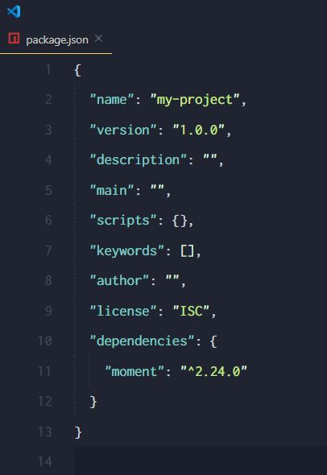

`package.json` 文件中，有一个<font color="red"> `dependencies`</font> 节点，专门用来记录您使用 `npm install` 命令安装了哪些包。

#### 5. <font color="red">一次性</font>安装所有的包

当我们拿到一个<font color="red">剔除了 `node_modules` </font>的项目之后，需要先把所有的包下载到项目中，才能将项目运行起来。
否则会报类似于下面的错误：

```sh
# 由于项目运行依赖于 moment 这个包，如果没有提前安装好这个包，就会报如下的错：
Error:Cannot find module 'moment'
```

可以运行<font color="red"> `npm install` </font>命令（或<font color="red"> `npm i`</font>）一次性安装所有的依赖包：
```sh
# 执行 npm install 命令时，npm 包管理工具会先读取 package.json 中的dependencies 节点，
# 读取到记录的所有依赖包名称和版本号之后，npm 包管理工具会把这些包一次性下载到项目中

npm install
```

#### 6. 卸载包

可以运行 <font color="red">`npm uninstall`</font> 命令，来卸载指定的包：
```sh
# 使用  npm uninstall 具体的包名称，来卸载指定的包
npm uninstall moment
```
注意：`npm uninstall` 命令执行成功后，会把卸载的包，自动从 `package.json` 的 `dependencies` 中移除掉。

#### 7. `devDependencies` 节点

如果某些包只在项目开发阶段会用到，在项目上线之后不会用到，则建议把这些包记录到 `devDependencies` 节点中。
与之对应的，如果某些包在开发和项目上线之后都需要用到，则建议把这些包记录到 `dependencies` 节点中。

您可以使用如下的命令，将包记录到 `devDependencies` 节点中：
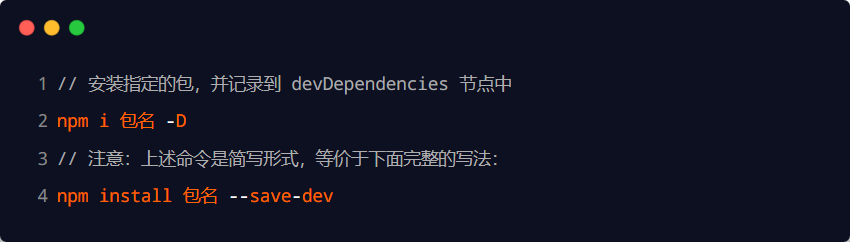

### 3.4 解决下包速度慢的问题

#### 1. 为什么下包速度慢

在使用 `npm` 下包的时候，默认从国外的 https://registry.npmjs.org/ 服务器进行下载，此时，网络数据的传输需要经过漫长的海底光缆，因此下包速度会很慢。

扩展阅读 - 海底光缆：
https://baike.baidu.com/item/%E6%B5%B7%E5%BA%95%E5%85%89%E7%BC%86/4107830

https://baike.baidu.com/item/%E4%B8%AD%E7%BE%8E%E6%B5%B7%E5%BA%95%E5%85%89%E7%BC%86/10520363

https://baike.baidu.com/item/APG/23647721?fr=aladdin

#### 2. 淘宝 `NPM` 镜像服务器

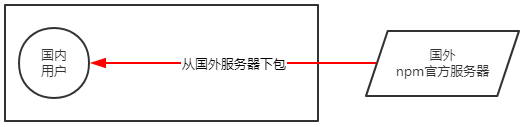
淘宝在国内搭建了一个服务器，专门把国外官方服务器上的包同步到国内的服务器，然后在国内提供下包的服务。从而极大的提高了下包的速度。

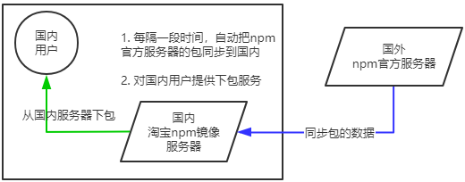
扩展：
镜像（Mirroring）是一种文件存储形式，一个磁盘上的数据在另一个磁盘上存在一个完全相同的副本即为镜像。

#### 3. 切换 `npm` 的下包镜像源

下包的镜像源，指的就是下包的服务器地址。

```sh
## 查看当前的下包镜像源

npm config get registry

## 将下包的镜像源切换为淘宝镜像源
npm config set registry=https//registry.npm.taobao.org/

## 检查进项源是否下载成功
npm config get registry

```

#### 4. `nrm`

- 为了更方便的切换下包的镜像源，我们可以安装 `nrm` 这个小工具，利用 `nrm` 提供的终端命令，可以快速查看和切换下包的镜像源。

```sh
# 通过 npm 包管理器 将nrm 安装为全局可用的工具
npm i nrm -g

# 查看所有的可用的镜像源
nrm ls

# 将下包的镜像源切换为 taobao 镜像
nrm use taobao

```

### 3.5 包的分类

- 使用 `npm` 包管理工具下载的包，共分为两大类，分别是：
    - 项目包
    - 全局包

#### 1. 项目包

- 那些被安装到项目的 `node_modules` 目录中的包，都是项目包。

- 项目包又分为两类，分别是：
    - 开发依赖包（被记录到 `devDependencies` 节点中的包，只在开发期间会用到）
    - 核心依赖包（被记录到 `dependencies` 节点中的包，在开发期间和项目上线之后都会用到）

```sh
npm i 包名 -D   #开发依赖包（会被记录到 devDependencies 节点下 ）
npm i 包名    #开发依赖包（会被记录到 dependencies 节点下 ）

```
#### 2. 全局包

- 在执行 `npm install` 命令时，如果提供了 `-g` 参数，则会把包安装为全局包。
- 全局包会被安装到 `C:\Users\用户目录\AppData\Roaming\npm\node_modules` 目录下。

```sh
npm i 包名 -g   ##全局安装指定的包
npm uninstall 包名 -g   ##卸载全局安装的包

```
- 注意：
    - 只有工具性质的包，才有全局安装的必要性。因为它们提供了好用的终端命令。
    - 判断某个包是否需要全局安装后才能使用，可以参考官方提供的使用说明即可。

#### 3. `i5ting_toc`

- `i5ting_toc` 是一个可以把 `md` 文档转为 `html` 页面的小工具，使用步骤如下：
```sh
npm i i5ting_toc -g   ##安装为全局包

i5ting_toc -f 要转换的md文档文件路径 -o   ##调用i5ting_toc 轻松实现 md 转html 的功能

```

### 3.6 规范的包结构

- 在清楚了包的概念、以及如何下载和使用包之后，接下来，我们深入了解一下包的内部结构。

- 一个规范的包，它的组成结构，必须符合以下 3 点要求：
    - 包必须以单独的目录而存在
    - 包的顶级目录下要必须包含 `package.json` 这个包管理配置文件
    - `package.json` 中必须包含 `name`，`version`，`main` 这三个属性，分别代表包的名字、版本号、包的入口。

- 注意：以上 3 点要求是一个规范的包结构必须遵守的格式，关于更多的约束，可以参考如下网址：
    - https://yarnpkg.com/zh-Hans/docs/package-json

### 3.7 开发属于自己的包

#### 1. 需要实现的功能

- 格式化日期
- 转义 `HTML` 中的特殊字符
- 还原 `HTML` 中的特殊字符

#### 1. 需要实现的功能

```js
//导入自己的包

const heihei = require('heihei-utils')

//功能1： 格式化日期----
const dt = heihei.dataFormat(new Date())


//输出2000-01-01 12:00:00
console.log(dt)

//功能2： 转义 HtML 中的特殊字符
const htmlStr = '<h1 style="color:red;"> 你好！&copy;<span>小黄</span></h1>'>
const str = heihei.htmlEscape(htmlStr)
console.log(str)

//功能3：还原 HTML 中的特殊字符
const rawHTML = heihei.htmlUnEscape(str)
console.log(rawHTML)

```
#### 2. 初始化包的基本结构

- 新建 `heihei-tools` 文件夹，作为包的根目录
- 在 `heihei-tools` 文件夹中，新建如下三个文件：
    - `package.json` （包管理配置文件）
    - `index.js`          （包的入口文件）
    - `README.md ` （包的说明文档）
#### 3. 初始化 `package.json`
```json
{
    "name":"heihei-tools",
    "version":"1.0.0",
    "main":"index.js",
    "description":"提供了格式化时间，HTMLEscape的功能",
    "keywords":["heihei","dateFormat","escape"],
    "license":"ISC",

}
```
关于更多 license 许可协议相关的内容，可参考 https://www.jianshu.com/p/86251523e898

#### 4. 在 `index.js` 中定义格式化时间的方法
```js
function dateFormat(dateStr){
    //...
}
function padZero(n){
    return n > 9 ? n : '0' + n
}

module.export = {
    dataFormate
}
```
#### 5. 在 `index.js` 中定义转义 `HTML` 的方法
```js
function htmlEscape(htmlStr){
    return htmlStr.replace(/<|>|"|&/g,(match)=>{
        switch (match){
            case '<':
                return "&lt;"
            case '>':
                return "&gt;"
            case '&':
                return "&amp;"
            case '"':
                return "&quot;"
        }
    })
}
```
6. 在 `index.js` 中定义还原 `HTML` 的方法
```js
function htmlUnEscape(htmlStr){
    return htmlStr.replace(/&lt;|&gt;|&amp;|&quot;/g,(match)=>{
        switch (match){
            case '&lt;':
                return "<"
            case '&gt;':
                return ">"
            case '&amp;':
                return '"'
            case '&quot;':
                return "&"
        }
    })
}
```
#### 7. 将不同的功能进行模块化拆分

- 将格式化时间的功能，拆分到 `src` -> `dateFormat.js` 中
- 将处理 `HTML` 字符串的功能，拆分到 `src` -> `htmlEscape.js` 中
- 在 `index.js` 中，导入两个模块，得到需要向外共享的方法
- 在 `index.js` 中，使用 `module.exports` 把对应的方法共享出去

#### 8. 编写包的说明文档

- 包根目录中的 `README.md` 文件，是包的使用说明文档。通过它，我们可以事先把包的使用说明，以 `markdown` 的格式写出来，方便用户参考。
- `README` 文件中具体写什么内容，没有强制性的要求；只要能够清晰地把包的作用、用法、注意事项等描述清楚即可。
- 我们所创建的这个包的 `README.md` 文档中，会包含以下 6 项内容：
- 安装方式、导入方式、格式化时间、转义 `HTML` 中的特殊字符、还原 `HTML` 中的特殊字符、开源协议


### 3.8 发布包

#### 1. 注册 `npm` 账号

- 访问 https://www.npmjs.com/ 网站，点击 `sign up` 按钮，进入注册用   户界面
- 填写账号相关的信息：`Full Name`、`Public Email`、`Username`、`Password`
- 点击 `Create an Account` 按钮，注册账号
- 登录邮箱，点击验证链接，进行账号的验证

#### 2. 登录 `npm` 账号

- `npm` 账号注册完成后，可以在终端中执行 `npm login` 命令，依次输入用户名、密码、邮箱后，即可登录成功。
- 注意：在运行 `npm login` 命令之前，必须先把下包的服务器地址切换为 `npm` 的官方服务器。否则会导致发布包失败！

#### 3. 把包发布到 `npm` 上

将终端切换到包的根目录之后，运行 `npm publish` 命令，即可将包发布到 `npm` 上（注意：包名不能雷同）。

#### 4. 删除已发布的包

- 运行 `npm unpublish 包名 --force` 命令，即可从 `npm` 删除已发布的包。
- 注意：
    - `npm unpublish` 命令只能删除 72 小时以内发布的包
    - `npm unpublish` 删除的包，在 24 小时内不允许重复发布
    - 发布包的时候要慎重，尽量不要往 `npm` 上发布没有意义的包！

## 模块的加载机制

### 4.1 优先从缓存中加载

- <font color="red">模块在第一次加载后会被缓存</font>。 这也意味着多次调用  <font color="red">`require()`</font> 不会导致模块的代码被执行多次。
- **注意**：不论是内置模块、用户自定义模块、还是第三方模块，它们都会优先从缓存中加载，<font color="red">从而提高模块的加载效率</font>。

### 4.2 <font color="red">内置模块</font>的加载机制

- 内置模块是由 `Node.js` 官方提供的模块，<font color="red">内置模块的加载优先级最高</font>。
- 例如，`require('fs')` 始终返回内置的 `fs` 模块，即使在 `node_modules` 目录下有名字相同的包也叫做 `fs`。

### 4.3 <font color="red">自定义模块</font>的加载机制

- 使用 `require()` 加载自定义模块时，必须指定以 <font color="red">`./` </font>或<font color="red"> `../`</font> 开头的<font color="red">路径标识符</font>。在加载自定义模块时，如果没有指定<font color="red"> `./`</font> 或<font color="red"> `../` </font>这样的路径标识符，则 `node` 会把它当作<font color="red">内置模块</font>或<font color="red">第三方模块</font>进行加载。

- 同时，在使用 `require()` 导入自定义模块时，如果省略了文件的扩展名，则 `Node.js` 会<font color="red">按顺序</font>分别尝试加载以下的文件：
    - 按照<font color="red">确切的文件名</font>进行加载
    - 补全<font color="red"> `.js`</font> 扩展名进行加载
    - 补全<font color="red"> `.json` </font>扩展名进行加载
    - 补全 <font color="red">`.node` </font>扩展名进行加载
    - 加载失败，终端报错

### 4.4 <font color="red">第三方模块</font>的加载机制

- 如果传递给 `require()` 的模块标识符不是一个内置模块，也没有以 ‘./’ 或 ‘../’ 开头，则 `Node.js` 会从当前模块的父目录开始，尝试从` /node_modules` 文件夹中加载第三方模块。
- <font color="red">如果没有找到对应的第三方模块，则移动到再上一层父目录中，进行加载，直到文件系统的根目录。</font>
- 例如，假设在  <font color="red"> C:\Users\itheima\project\ </font> foo.js 文件里调用了 require('tools')，则 Node.js 会按以下顺序查找：
    - <font color="red"> C:\Users\itheima\project\ </font> node_modules\tools
    - <font color="red"> C:\Users\itheima\ </font> node_modules\tools
    - <font color="red"> C:\Users\ </font>node_modules\tools
    - <font color="red">C:\ </font>node_modules\tools

### 4.5 <font color="red">目录</font>作为模块

- 当把目录作为模块标识符，传递给 `require()` 进行加载的时候，有三种加载方式：
- 在被加载的目录下查找一个叫做 `package.json` 的文件，并寻找 `main` 属性，作为 `require()` 加载的入口
- 如果目录里没有 `package.json` 文件，或者 `main` 入口不存在或无法解析，则 `Node.js` 将会试图加载目录下的<font color="red"> `index.js` </font>文件。
- 如果以上两步都失败了，则 `Node.js` 会在终端打印错误消息，报告模块的缺失：`Error: Cannot find module 'xxx'`

